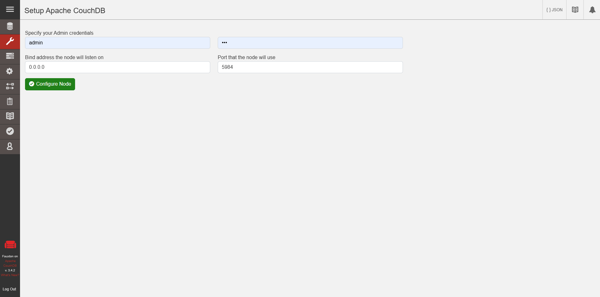

# Trustnet Api

## Installation

```console
$ npm init
```

```console
$ npm install express
```

```console
$ npx express-generator
```

## Run

```console
$ npm install
```

Install Apache CouchDB in:

```
https://couchdb.apache.org/
```

Record your CouchDB credentials.

Then, open Project Fauxton to access CouchDB instance

```
http://localhost:5984/_utils/#login
```

Setup CouchDB by configuring a Cluster or Single Node. We will use Single Node for development.



Run the project:

- LINUX or MAC

```console
$ DEBUG=app:* npm start
```

- WINDOWS SHELL

```console
$ set DEBUG=app:* & npm start
```

- WINDOWS POWERSHELL

```console
$ $env:DEBUG='app:*'; npm start
```
